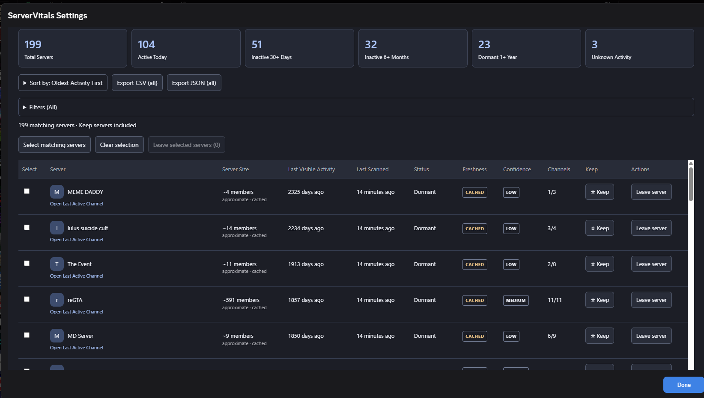
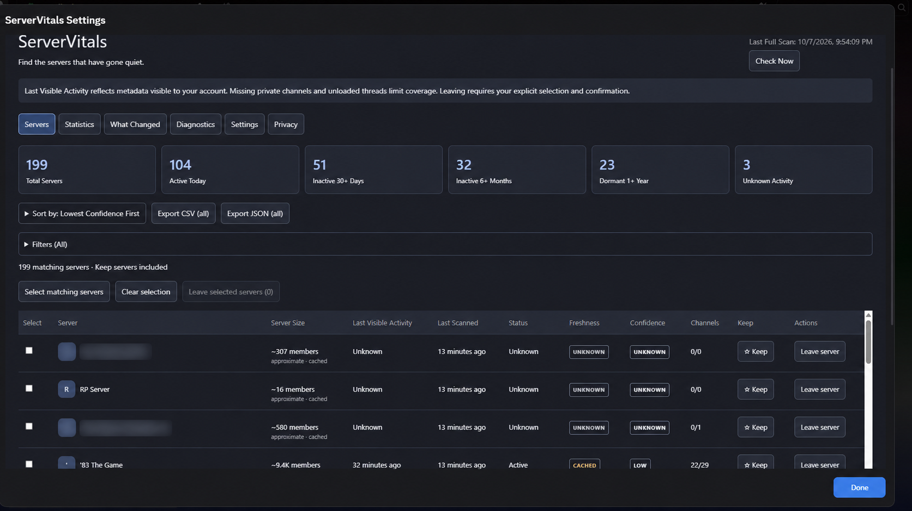
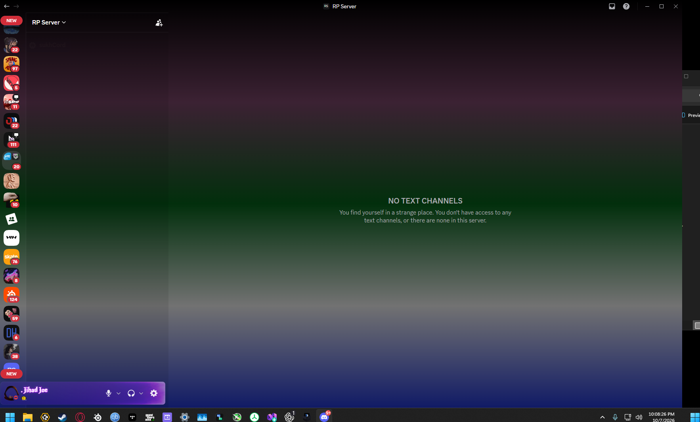

# ServerVitals

**Find the servers that have gone quiet.**

ServerVitals shows the **Last Visible Activity** across your Discord servers, helping you identify active, quiet, inactive and dormant communities from one local dashboard. Separate implementations support **BetterDiscord** and a **Vencord custom userplugin**. No fixed server-count limit is imposed.

> **Testing Build — 0.1.6**
>
> This release has not completed the maintainer's manual stability checklist. Automated tests and source builds do not establish live Discord compatibility or stability. No stable release is published automatically.

**Platform testing:** BetterDiscord has received maintainer testing and feedback, with known limitations documented below. Vencord is included for testing: its source and full build have automated validation, but it has **not been tested by a user in a live Vencord installation**.

## AI Development Disclosure

**The initial ServerVitals codebase is 100% AI generated using OpenAI Codex.** This statement describes the initial implementation; future human contributions may change the codebase.

The maintainer must manually install, test and evaluate releases before marking them stable. This alpha has not completed that process.

ServerVitals is independently maintained and is not an official BetterDiscord or Vencord plugin. Current BetterDiscord official addon rules prohibit automatically generated submissions; Vencord requires disclosure, human understanding and review of AI-assisted contributions. This initial implementation is therefore distributed independently through this repository and will not be submitted to the official BetterDiscord addon directory or official Vencord repository. Manual testing does not confer official approval.

References checked 2026-10-07: [BetterDiscord guidelines](https://docs.betterdiscord.app/plugins/publishing/guidelines), [Vencord contribution policy](https://github.com/Vendicated/Vencord/blob/main/CONTRIBUTING.md).

## Overview

Open ServerVitals from plugin settings, keep the default **Oldest Activity First** ordering, inspect freshness and confidence, then decide for yourself which communities to keep. ServerVitals never automatically leaves a server.

Every row shows server name/icon, size when available, Last Visible Activity, Last Scanned, activity category, freshness, confidence, visible source count and local **★ Keep** state.

## Screenshots



Maintainer-supplied live BetterDiscord screenshot, sorted by **Oldest Activity First**. Last Visible Activity, Last Scanned, cached evidence and confidence remain separate. The displayed server count and dates are examples from one account, not product limits or verified absolute server inactivity.

| ServerVitals: Unknown activity                                                                                                                      | Discord: RP Server has no accessible text channels                                                        |
| --------------------------------------------------------------------------------------------------------------------------------------------------- | --------------------------------------------------------------------------------------------------------- |
|  |  |

Live BetterDiscord example of **Unknown** activity, with two server names/icons redacted for privacy. A member count can be cached even when activity is Unknown. See the explanation below. These screenshots demonstrate the maintainer's installation, not completion of the stability checklist or live Vencord verification.

The adjacent screenshot shows **RP Server** still listed in Discord while Discord displays **No text channels**. It may have no text channels or the account may lack access to them. This illustrates why ServerVitals reports Unknown; it does not establish that the server was deleted or that the account was banned.

## Features

- One dashboard for any number of guilds available to the client.
- Oldest/newest, alphabetical, server-size and lowest-confidence sorting. Unknown activity sorts after known dates.
- Combined activity/confidence/Keep filters. Search is temporarily removed in the local unreleased build while BetterDiscord typing problems are investigated.
- Local Keep metadata and optional hiding from the server view, without changing activity or overall statistics.
- Monotonic activity cache, separate inspection time, coverage-derived confidence and two-scan comparison.
- Loaded thread/forum reply support, conservative unknown handling, diagnostic counts and measured scan duration.
- Local CSV/JSON exports. Manual **Check Now** scans only; opening the dashboard loads cached results. Cache size and clearing are available in Settings.
- Settings access in both hosts; no DOM selectors, required helper plugin or ServerVitals backend.

## Statistics Dashboard

View Total Servers, Active Today, Active This Week, Inactive 7+/30+/90+ Days, Inactive 6+ Months, Dormant 1+ Year, Unknown Activity, Keep Servers, Cached Results, Partial Results and scanned source totals. Average and median days since known activity are also shown.

Statistics include the entire list, including Keep and filtered-out guilds. Bands overlap: a server inactive for 200 days appears in several inactivity counts. Today means rolling 24 hours; six months means 180 days. Unknown never counts as dormant. These are contextual observations, not recommendations to leave servers.

### Why a server count may differ from Discord's limit message

The header separates the current **joined server count** reported by Discord's GuildStore from **loaded guild records** and **servers in the saved scan**. A saved scan can be older than your current memberships. Discord may also expose additional join-request entries without a joined guild record; these are counted separately when the local request store is loaded, not inserted into activity statistics or Leave selections.

Diagnostics shows all four counts, or Unavailable when a source cannot be read. Guild-store changes update the lightweight counts without running an activity scan. For example, 199 joined guilds plus one join-request entry is a possible explanation for a discrepancy, not proof of Discord's account-slot accounting. ServerVitals does not query your membership limit, invent a missing server, force a total of 200 or diagnose the exact reason for a join failure. Use Check Now to update scan coverage, then compare the Diagnostics counts with Discord's server list.

## BetterDiscord Installation

Download [ServerVitals.plugin.js](dist/betterdiscord/ServerVitals.plugin.js), copy the raw file to your BetterDiscord plugins folder, enable it and open its settings → **Open ServerVitals**. Use BetterDiscord's **Open Plugins Folder** button to locate the correct directory. No helper library is needed.

Full instructions and typical Windows/macOS/Linux paths: [Install for BetterDiscord](docs/INSTALL-BETTERDISCORD.md).

## Vencord Installation

Copy the complete [serverVitals folder](dist/vencord/serverVitals) to your own Vencord source checkout at `src/userplugins/serverVitals`, then rebuild Vencord using its documented procedures. The entry point is `index.tsx`; include `shared`. Do not put it in `src/plugins`.

The release archive `ServerVitals-Vencord.zip` contains only that userplugin folder, not a modified Vencord distribution. Enable ServerVitals and use plugin settings → **Open ServerVitals**.

Full instructions: [Install for Vencord](docs/INSTALL-VENCORD.md), [official custom plugin documentation](https://docs.vencord.dev/installing/custom-plugins/).

## How Last Visible Activity Works

The scanner enumerates loaded guild channels, checks the account's view/history permissions, reads existing last-message IDs and decodes Discord Snowflakes with `BigInt`. It selects the newest trustworthy message timestamp across those sources. It never retrieves message bodies to calculate activity.

Loaded joined/unjoined thread message IDs can contribute. Forum parent IDs are not treated as newest reply timestamps. Unloaded and archived threads are not fetched. Private or inaccessible channels cannot be represented. This measures **Last Visible Activity**, not absolute server activity, voice participation, community health or abandonment.

Normal scanning makes **zero network/API requests**. Server icons may load from Discord's CDN; clicking a server/channel invokes Discord's usual navigation and loading.

## Last Active vs Last Scanned

**Last Visible Activity** is the newest trustworthy message observation. **Last Scanned** is when ServerVitals last inspected that guild's available metadata. A guild can show activity eight months ago and inspection thirty seconds ago. Last Full Scan is the completion time of the latest successful full scan.

## Data Freshness

| Badge   | Meaning                                                                                                              |
| ------- | -------------------------------------------------------------------------------------------------------------------- |
| LIVE    | Current local metadata provided the timestamp with complete supported coverage. Does not mean a new server response. |
| CACHED  | An earlier trustworthy observation was retained because current metadata could not confirm it.                       |
| PARTIAL | A current timestamp exists, but sources/threads/metadata coverage is incomplete.                                     |
| UNKNOWN | No trustworthy current or cached activity timestamp exists.                                                          |

This alpha has **loaded-only thread coverage**. Real results therefore normally show PARTIAL, not LIVE. It deliberately avoids claiming complete coverage of archived threads. Text badges convey meaning without relying on color.

## Activity Confidence

Confidence measures evidence coverage, not recency. Current results score the fraction of loaded sources supplying valid IDs, minus penalties for incomplete thread coverage and inspection issues. HIGH >=90, MEDIUM >=60, LOW below 60. No activity means UNKNOWN. Cached results are at most MEDIUM, retaining the quality of the original observation.

A recent server can have LOW confidence. An old timestamp can have HIGH confidence when complete evidence exists, although this alpha's conservative thread coverage normally caps real current observations at MEDIUM. Hover the badge for coverage details. See the exact [confidence calculation](docs/ARCHITECTURE.md#observation-freshness-and-confidence).

## Server Size

Exact reported guild member fields display integers; explicitly approximate fields and the count-store fallback display `~` with compact formatting. Missing counts display Unavailable. Retained size is labeled cached. The count store has no inspected accuracy flag, so its values are conservatively approximate. Counts may be stale even when locally reported as exact.

Size is sortable and its column can be hidden. It never affects activity classification or the value of keeping a community. No requests are made solely to obtain counts.

## What Changed Since Last Scan

Compare current and previous full snapshots for new/removed servers, activity advances, category/threshold crossings, freshness/confidence changes, unknown/known transitions and meaningful size changes. Click a grouped change to filter current rows. Removed guilds remain named in the comparison for one scan.

Activity advancement is called **New visible activity detected**. Category transitions use exact labels such as **Moved from Inactive to Active**, avoiding unsupported claims. Last Scanned alone creates no event. Missing current data normally becomes CACHED through monotonic retention rather than erasing known activity.

## What Unknown activity means

**Unknown means ServerVitals has no trustworthy visible-message timestamp for that server.** It is missing evidence, not an inactivity category. Unknown never becomes Dormant simply because no timestamp exists.

Possible explanations include:

- No text channels are accessible to your account, or there are no supported visible text channels.
- A role, verification step or permission setting prevents access.
- Discord has not loaded the relevant channel or last-message metadata.
- Available channels have no usable last-message ID, or relevant thread/forum metadata is unavailable.
- A temporarily unavailable guild or a Discord internal change prevents inspection.

In the maintainer's supplied example, Discord itself displays **No text channels** and explains that the account either lacks access or the server has none. That supports an access/coverage explanation; it does not tell ServerVitals why access is missing. The plugin cannot infer a ban, deletion, an administrator's decision or abandonment from Unknown alone.

The Channels column reports usable timestamp sources over expected loaded sources. **0/0** means no eligible sources were available to inspect; **0/1** means one expected source supplied no usable timestamp. Neither proves that the whole server has no messages.

### Unknown and the cache

Unknown can be saved in a scan snapshot with `lastVisibleActivity: null`, its inspection time and any available member-count metadata. It stays Unknown until trustworthy activity becomes available. Cached size and cached activity are independent: an approximate cached member count does not establish an activity date.

If ServerVitals previously recorded a trustworthy activity timestamp and current metadata cannot confirm it, the monotonic cache normally retains that date with **CACHED** freshness instead of replacing it with Unknown. **Last Scanned** records the most recent inspection; it does not mean message metadata was complete or newly fetched.

Try **Check Now** once after Discord finishes loading, inspect the server's visible channel list and review Diagnostics. ServerVitals does not probe hidden channels or make requests to determine whether you were banned or a server was deleted.

## Activity Categories

| Category      | Default                             |
| ------------- | ----------------------------------- |
| Active        | Less than 7 days                    |
| Quiet         | 7 to less than 30 days              |
| Inactive      | 30 to less than 180 days            |
| Very Inactive | 180 through 365 days                |
| Dormant       | More than 365 days                  |
| Unknown       | No trustworthy activity observation |

Four increasing day thresholds are configurable in the dashboard. Fixed named statistics/filter ranges keep their documented values.

## Manual checks and cache size

**Check Now** inspects currently loaded Discord metadata. Enabling the plugin or opening the dashboard loads saved results without running a scan. Automatic refresh is currently removed.

The cache stores only the **current scan and previous scan**, plus local Keep preferences. Each successful check replaces these snapshots; it does not append a permanent history or collect message text. Cache size depends on the number of servers and stored metadata, rather than the total number of checks. Settings shows UTF-8 cache bytes (host storage may add overhead). Clearing the cache preserves Keep and leaves observations empty until Check Now is clicked.

## Leaving selected servers

Use row checkboxes to select servers, or **Select matching servers** to select the currently filtered results across pages. Selection may include rows hidden by later filter changes; the confirmation lists every target by name. Click **Leave selected servers**, inspect the names, then explicitly confirm. Individual rows also have **Leave server**.

Keep servers are protected. Known owned servers are blocked until ownership is transferred through Discord. Leaving may require a new invitation to rejoin. Confirmed batches use Discord’s existing client action, run sequentially with 1.5 seconds between actions, and stop at the first error without retrying. They are never triggered by activity categories, checks, or timers. Closing/disabling the plugin stops subsequent actions; an already sent action cannot be undone.

## Privacy

Local only. No token access, message-body collection, telemetry, analytics, backend, external search or data upload. No unsolicited membership changes, messages, joins or deletes. Leaving servers is an explicit user-confirmed action through Discord’s existing client function; confirmed batches run sequentially and stop on error. Current/previous snapshots and Keep persist in local host storage, separated by account. Exports stay local until you choose to share them.

Read [PRIVACY.md](docs/PRIVACY.md) for stored fields, CDN/navigation details and deletion behavior. Changes to privacy behavior require updated documentation before release.

## Accuracy Limitations

- Client metadata can be stale or unloaded; scanning does not request a fresh server response.
- Private/inaccessible channels and unloaded/archived threads are excluded.
- Empty versus uninitialized channel metadata cannot always be distinguished.
- Forum parent IDs do not prove newest reply activity; only loaded post metadata contributes.
- Voice/stage text is measurable; calls, reactions and general participation are not.
- Confidence is a deterministic heuristic, not a probability or guarantee.
- A cached source may later lose permissions; navigation rechecks current visibility.
- Monotonic retention can preserve an activity observation from a deleted/inaccessible channel. It is labeled cached when not reconfirmed, not silently erased.

## Testing

Run `npm ci` and `npm run check`. For a real Vencord checkout typecheck/build, use `npm run validate:vencord` after following [TESTING.md](docs/TESTING.md). Read the [manual release checklist](docs/RELEASE_CHECKLIST.md) before calling any release stable. Automated and synthetic checks do not substitute for live installation.

See the [initial development report](docs/FINAL_REPORT.md) for delivered behavior, validation results, artifact locations and publication status.

## Known Issues

- Live BetterDiscord and Vencord installation/stability tests remain pending for this initial alpha.
- Discord stores and navigation/modal internals can change without notice.
- Loaded-only thread coverage generally produces PARTIAL/MEDIUM or lower.
- Read-only local scans cannot force unloaded metadata to become complete.
- Relative times/statistics update with dashboard interaction or refresh; no constant UI polling.
- Account changes stop the scanner; re-enable to load the new account's separate cache.

## Troubleshooting

If a required store is missing, wait for Discord to finish loading, then disable/re-enable ServerVitals once. Inspect the local Diagnostics tab and check this repository for updates. Repeated re-enabling does not fix changed Discord internals. Previous successful results are retained on scan failure. Unknown is expected when no usable metadata exists.

Please report ServerVitals-specific issues through this repository's **GitHub Issues**. **Do not ask BetterDiscord or Vencord maintainers to troubleshoot problems caused specifically by ServerVitals.** Include versions and aggregate diagnostics; never post tokens, message contents or private exports.

## Development

```sh
npm ci
npm run check
```

`packages/core` holds pure logic, `packages/discord` the scanner/controller, `packages/ui` the shared React view, and platform folders the adapters. `npm run build` produces the normal BetterDiscord plugin and a self-contained Vencord userplugin source folder. Runtime React comes from the host. Read [ARCHITECTURE.md](docs/ARCHITECTURE.md) for research, decisions and internal dependencies.

Versions are synchronized at **0.1.6**. CI validates code/builds without publishing stable releases. Alpha publication is independent of upstream plugin directories.

## Contributing

See [CONTRIBUTING.md](CONTRIBUTING.md). Disclose AI assistance, understand/review changes, preserve the initial-implementation disclosure and maintain local read-only scanning and explicit membership confirmation. Report security issues using [SECURITY.md](SECURITY.md).

## License

[GNU General Public License v3.0 or later](LICENSE). Open source; inspect, test, modify and redistribute subject to the license. No warranty.

## Disclaimer

ServerVitals is an independent project and is not affiliated with, endorsed by, sponsored by, or officially supported by Discord Inc., BetterDiscord, or Vencord.

Discord client modifications may conflict with Discord's Terms or policies. Users install client modifications at their own discretion. This project does not claim users will definitely be banned or guarantee any account outcome. AI generation and manual testing do not establish official approval.
